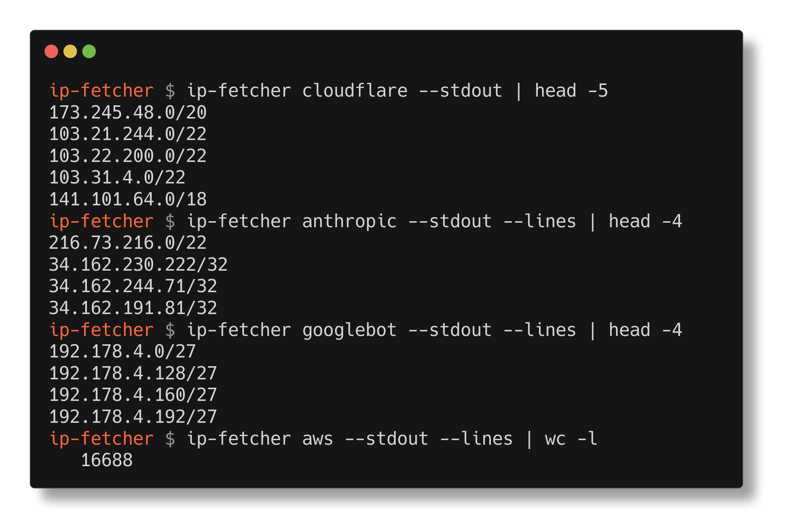

# ip-fetcher

[](https://pkg.go.dev/github.com/jonhadfield/ip-fetcher)
[](https://github.com/jonhadfield/ip-fetcher/actions/workflows/test.yml)
[](https://sonarcloud.io/summary/new_code?id=jonhadfield_ip-fetcher)
[](https://goreportcard.com/report/github.com/jonhadfield/ip-fetcher)
[](https://github.com/jonhadfield/ip-fetcher/releases/latest)
[](LICENSE)

## about

ip-fetcher is a go library and cli used to retrieve public ip prefixes from cloud
platforms, CDNs, crawler bots, monitoring services and threat intelligence feeds.
Please raise an issue if you have any issues or suggestions for new providers.



## supported providers

66 sources:

| Category | Providers |
| --- | --- |
| **Cloud & hosting** | [Alibaba](https://www.alibabacloud.com) · [AWS](https://aws.amazon.com/) · [Contabo](https://contabo.com/) · [DigitalOcean](https://www.digitalocean.com/) · [Fly.io](https://fly.io/) · [GCP](https://cloud.google.com/) · [Hetzner](https://www.hetzner.com) · [IBM Cloud](https://www.ibm.com/cloud) · [Leaseweb](https://www.leaseweb.com/) · [Linode](https://www.linode.com) · [M247](https://www.m247.com/) · [Microsoft Azure](https://azure.microsoft.com) · [Oracle Cloud Infrastructure](https://www.oracle.com/cloud/) · [OVHcloud](https://www.ovhcloud.com) · [Render](https://render.com/) · [Scaleway](https://www.scaleway.com/) · [Tencent Cloud](https://www.tencentcloud.com/) · [Vultr](https://www.vultr.com) |
| **CDN & edge** | [Akamai](https://www.akamai.com) · [Bunny.net](https://bunny.net/) · [CDN77](https://www.cdn77.com/) · [Cloudflare](https://www.cloudflare.com/) · [Fastly](https://www.fastly.com/) · [Gcore CDN](https://gcore.com/) · [Imperva](https://www.imperva.com) · [Zscaler](https://www.zscaler.com) |
| **Crawler bots** | [AhrefsBot](https://api.ahrefs.com/v3/public/crawler-ip-ranges) · [Anthropic Crawler Bots](https://claude.com/crawling/bots.json) (ClaudeBot, Claude-User, Claude-SearchBot) · [Applebot](https://support.apple.com/en-us/119829) · [Bingbot](https://www.bing.com/webmasters/help/which-crawlers-does-bing-use-8c184ec0) · [DuckDuckBot](https://duckduckgo.com/duckduckbot) · [Googlebot](https://developers.google.com/search/docs/crawling-indexing/googlebot) · [Google Special Crawlers](https://developers.google.com/search/docs/crawling-indexing/verifying-googlebot) · [Google User-Triggered Fetchers](https://developers.google.com/search/docs/crawling-indexing/verifying-googlebot) · [OpenAI Bots](https://platform.openai.com/docs/bots) (GPTBot, OAI-SearchBot, ChatGPT-User)[^stale] · [PerplexityBot](https://www.perplexity.com/perplexitybot.json)[^stale] |
| **Uptime & monitoring** | [Better Stack](https://betterstack.com/docs/uptime/ip-addresses/) · [Checkly](https://www.checklyhq.com/docs/monitoring/allowlisting/) · [Datadog](https://docs.datadoghq.com/api/latest/ip-ranges/) · [Grafana Synthetic Monitoring](https://grafana.com/docs/grafana-cloud/testing/synthetic-monitoring/create-checks/public-probes/) · [New Relic Synthetics](https://docs.newrelic.com/docs/synthetics/synthetic-monitoring/administration/synthetic-public-minion-ips/) · [Pingdom](https://www.pingdom.com/) · [Sentry Uptime](https://docs.sentry.io/security-legal-pii/security/ip-ranges/) · [Site24x7](https://www.site24x7.com/multi-location-web-site-monitoring.html) · [StatusCake](https://www.statuscake.com/) · [updown.io](https://updown.io/api) · [UptimeRobot](https://uptimerobot.com/help/locations/) · [Uptrends](https://www.uptrends.com/support/kb/account/ip-addresses-for-whitelisting) |
| **Vulnerability scanners** | [Detectify](https://docs.detectify.com/network-setup/scanner-ip-addresses) · [Tenable Cloud Scanners](https://docs.tenable.com/vulnerability-management/Content/Settings/Sensors/CloudSensors.htm)[^stale] |
| **Threat intelligence** | [AbuseIPDB](https://www.abuseipdb.com/) · [Blocklist.de](https://www.blocklist.de/en/index.html) · [CINS Army List](https://cinsscore.com/) · [DShield](https://www.dshield.org/) · [Emerging Threats](https://rules.emergingthreats.net/blockrules/) · [GreenSnow](https://greensnow.co/) · [Spamhaus DROP](https://www.spamhaus.org/blocklists/do-not-route-or-peer/) · [Team Cymru Bogons](https://www.team-cymru.com/bogon-reference) |
| **Other services** | [Atlassian](https://ip-ranges.atlassian.com/) · [GitHub](https://www.github.com) · [Google](https://www.google.com/) · [iCloud Private Relay](https://support.apple.com/en-us/HT212614) · [MaxMind GeoIP](https://www.maxmind.com) · [Stripe](https://docs.stripe.com/ips) · [Zoom](https://support.zoom.com/hc/en/article?id=zm_kb&sysparm_article=KB0060548) |

Plus a **Custom URL** source, for any list not covered above.

[^stale]: These feeds are still served and still parse, but their publishers
have not regenerated them recently. As of 2026-08-29 the `creationTime` in the
OpenAI document was 2025-10-30 and PerplexityBot's was 2025-02-07, and as of
2026-09-02 Tenable's `createDate` was 2026-03-31 - a much shorter gap than the
crawler feeds, and a scanner list changes less often, but still worth a look
before relying on it. The prefixes may no longer reflect the addresses those
services use, so treat them with caution when allowlisting. Each provider
carries the value if you want to check it yourself: `Doc.CreationTime`, or
`Doc.CreateDate` for Tenable.

## CLI

### install

On macOS and linux, using [homebrew](https://brew.sh):

```bash
brew install jonhadfield/tap/ip-fetcher
```

On macOS you can also use the signed installer:

```bash
curl -fLO https://github.com/jonhadfield/ip-fetcher/releases/latest/download/ip-fetcher_macos.pkg
sudo installer -pkg ip-fetcher_macos.pkg -target /
```

That puts `ip-fetcher` in `/usr/local/bin`. The package is notarized with a
stapled ticket, so it installs with no Gatekeeper warning and nothing needs
clearing afterwards. Double-clicking the `.pkg` works too.

Otherwise, download the latest release [here](https://github.com/jonhadfield/ip-fetcher/releases) and then install:

```bash
install <ip-fetcher binary> /usr/local/bin/ip-fetcher
```
_use: `sudo install` if on linux_

On macOS, a binary downloaded through a browser is quarantined, and Gatekeeper
will refuse to run it. The darwin binaries are signed and notarized, but a
notarization ticket cannot be stapled into a bare executable, so macOS cannot
verify it offline. Homebrew and the `.pkg` above both handle this; if you took
a tarball instead, clear the flag manually:

```bash
xattr -d com.apple.quarantine /usr/local/bin/ip-fetcher
```

### run

```
ip-fetcher <provider> <options>
```

Use `ip-fetcher --help` to list the providers, and `ip-fetcher <provider> --help`
for a provider's options.

#### common options

| option | description |
| ------ | ----------- |
| `--stdout`, `-s` | write the prefixes to stdout |
| `--Path`, `-p` | write the prefixes to this path; if it is an existing directory then a provider specific default filename is used |
| `--format`, `-f` | output format, on providers that support it: `json` (default), `yaml`, `lines`, `csv` |
| `--lines` | shorthand for `--format lines` (newline separated prefixes) |

At least one of `--stdout` and `--Path` must be given.

#### examples

```bash
# output aws prefixes to the console
ip-fetcher aws --stdout

# save gcp prefixes to a file
ip-fetcher gcp --Path prefixes.json

# write cloudflare's ipv4 prefixes to a directory, using the default filename
ip-fetcher cloudflare -4 --Path /tmp

# newline separated prefixes
ip-fetcher fastly --format lines --stdout

# read prefixes from one or more arbitrary URLs
ip-fetcher url --stdout https://example.com/ips.txt

# providers requiring credentials
ip-fetcher abuseipdb --key <api key> --confidence 90 --stdout
ip-fetcher geoip --key <license key> --Path /tmp --format mmdb
```

#### publish

`ip-fetcher publish` fetches a subset of the providers above (those wired into
`publisher/`) and commits the results, plus a generated README, to a git
repository. It is configured with:

| environment variable | description |
| -------------------- | ----------- |
| `GITHUB_PUBLISH_URL` | the repository to publish to |
| `GITHUB_TOKEN` | a token with write access to that repository |

#### logging

Set `PREFIX_FETCHER_LOG` to change log verbosity, e.g.
`PREFIX_FETCHER_LOG=debug ip-fetcher aws --stdout`.

## API

The following example uses the GCP (Google Cloud Platform) provider.

### installation
```
go get github.com/jonhadfield/ip-fetcher/providers/gcp
```
### basic usage
```
package main

import (
    "fmt"
    "github.com/jonhadfield/ip-fetcher/providers/gcp"
)

func main() {
    g := gcp.New()         // initialise client
    doc, err := g.Fetch()  // fetch prefixes document
    if err != nil {
        panic(err)
    }

    for _, p := range doc.IPv6Prefixes {
        fmt.Printf("%s %s %s\n", p.IPv6Prefix.String(), p.Service, p.Scope)
    }
}
```
